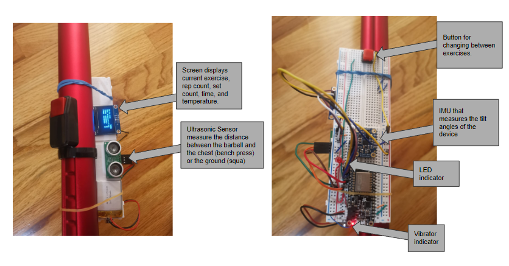
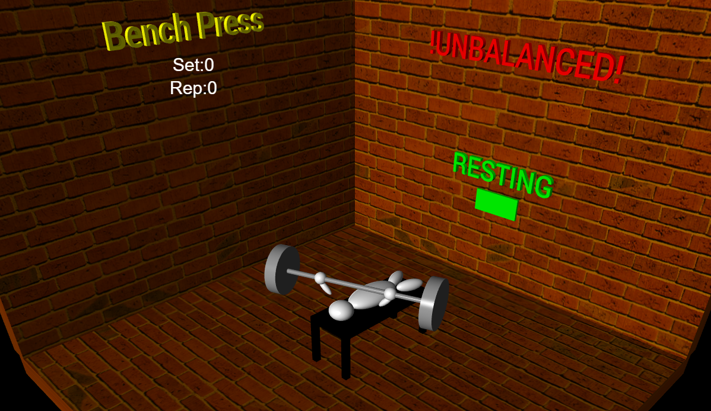
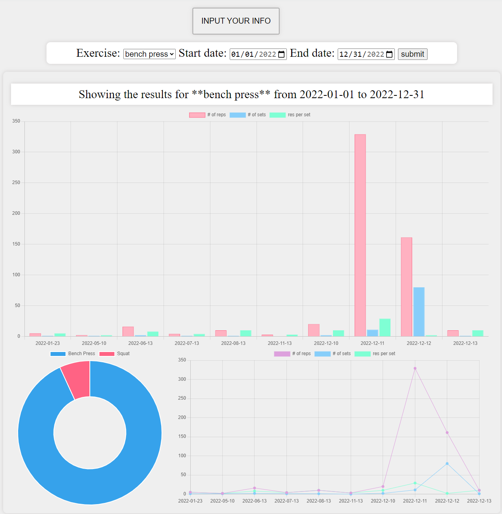

# workout helper

<li>This is a IoT device. 
<li>This is deviced is to be mounted on barbell when doing Squat or Bench Press.(more exercises can be easily added)
<li> This device will count the number of reps and sets.
<li>This device will warn the user when the barbell is unbalanced.
<li>This device will keep track of the rest time during set and warn the user when time is up. 
<li>This device will make sure the user is doing full range of motion.
<li>If the barbell hit the desired height, the device will vibrate to indicate a successful rep. 
<li>Otherwise the rep will not be counted. 
 

      
 
 
 

